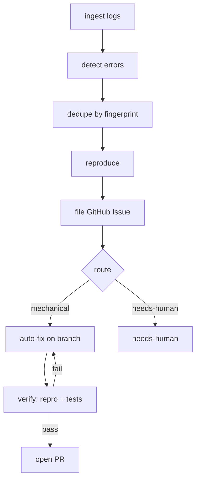

# bug-loop

An agent-pipeline demo: **logs → tickets → verified fixes**, built twice on the same contracts — once with **LangGraph JS** (Day 2) and once with the **Claude Agent SDK** (Day 4).

The toy target is `apps/leaky-service`, a small order API that writes structured JSONL logs and ships with a handful of seeded failure modes. Shared types and helpers live in `shared/`. Pipelines consume those contracts; they do not re-invent fingerprinting, log reading, or GitHub ticket shape.

## Stage graph



## Design principles

- **Verifier before writer.** A fix is not done until repro no longer fails and tests pass. The graph edges encode that; the model does not get to declare victory.
- **Cycles are why you use a graph.** Fix ⇄ verify is a loop with a retry budget. Linear chains fake this with spaghetti; graphs make it first-class.
- **Cost routing.** Cheap/deterministic stages (ingest, fingerprint, dedupe, `gh` calls) use no model. A cheap model classifies route (mechanical vs needs-human). A frontier model only runs on the fix stage.
- **Failure routes to a human.** Judgment bugs and ambiguous product questions land on `needs-human` with a ticket — not a speculative patch.

## Seeded bug categories

The service intentionally exercises four failure *categories* (no spoilers on exact lines):

1. **Null dereference** on create — missing nested fields crash the handler (mechanical).
2. **Unhandled rejection** on ship — an async provider path is not awaited/caught (mechanical).
3. **Invalid date parsing** on list filters — bad `since` values blow up ISO conversion (mechanical).
4. **Judgment / product ambiguity** on discounts — totals can go negative; the service warns and stores rather than deciding policy (must not be auto-fixed).

Happy-path tests avoid all four and pass with the bugs present.

## Quickstart

```bash
bun install

# Start the toy service (writes logs/leaky-service.jsonl)
bun run service

# In another terminal: generate mixed valid + buggy traffic
bun run traffic -- --count 50 --seed 42 --base http://localhost:3000

# Typecheck & tests
bun run typecheck
bun test
```

Pipeline commands (coming Day 2 / Day 4):

```bash
# Day 2 — LangGraph JS
# bun run --filter @bug-loop/pipeline-langgraph start

# Day 4 — Claude Agent SDK
# bun run --filter @bug-loop/pipeline-agent-sdk start
```

Set `DRY_RUN=1` when exercising GitHub helpers without calling `gh`.

## Repo layout

```
apps/leaky-service/     # buggy order API + traffic generator + happy-path tests
shared/                 # stage contracts, fingerprint, logtail, gh helpers
pipelines/langgraph/    # Day 2 stub
pipelines/agent-sdk/    # Day 4 stub
```

| Package | Role |
|---------|------|
| `@bug-loop/leaky-service` | HTTP API, JSONL logger, traffic script |
| `@bug-loop/shared` | `LogEvent`, `Fingerprint`, `Incident`, `TriageState`, … |
| `@bug-loop/pipeline-langgraph` | Placeholder — LangGraph implementation |
| `@bug-loop/pipeline-agent-sdk` | Placeholder — Agent SDK implementation |

## Root scripts

| Script | What it does |
|--------|----------------|
| `bun run typecheck` | Project references build (`tsc -b`) |
| `bun test` | All workspace tests |
| `bun run service` | Start leaky-service on `:3000` |
| `bun run traffic` | Run the seeded traffic generator |

## License

Demo / interview material — not production software.
