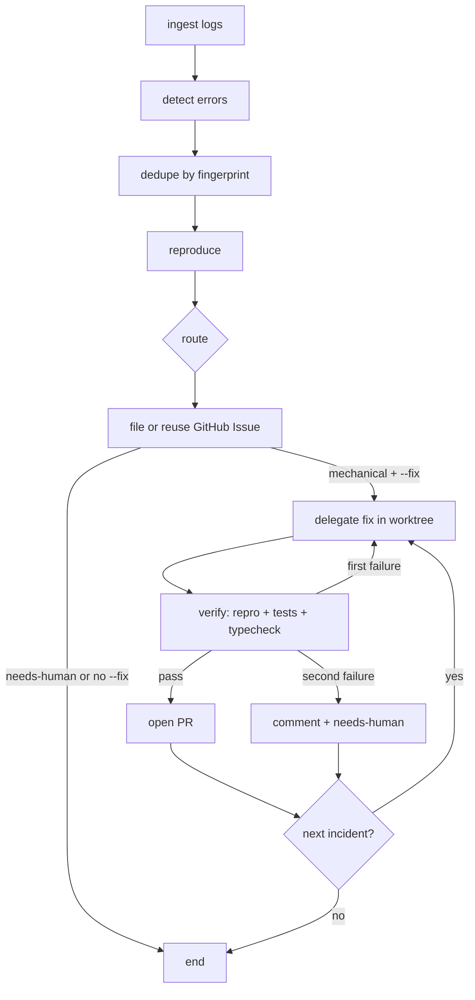

# bug-loop

An agent-pipeline demo: **logs → tickets → verified fixes**, built twice on the same contracts - once with **LangGraph JS** and once with the **Claude Agent SDK**.

## The 60-second answer

*This repo exists to answer "how would you set up your agent pipeline?" with something runnable.*

Most agent systems are pipeline-shaped - a router plus specialists covers the large majority of cases. Reach for a graph framework (LangGraph) when you need **cycles, conditional routing, shared state, or human-in-the-loop interrupts**; below that, a pipeline is typed functions + routing + state, and the framework buys you resumability, not intelligence. This repo is that claim, built both ways.

Three principles drive the design:

1. **Verification is the load-bearing layer.** Every stage that writes has a verifier in front of it: reproduction before the ticket, repro-gone + tests + typecheck before the PR. The fix→verify edge is a bounded retry cycle - exactly the thing a graph expresses that a chain can't.
2. **Route to the right capability.** Deterministic stages use no model. Cheap classification where judgment is thin, an agent (Claude Agent SDK, read-only tools) where judgment is real, and a coding agent (Codex or Grok, behind one `Fixer` interface) only in the fix stage. The harness is swappable because the contract is the boundary.
3. **Failure routes to a human, by design.** One seeded bug is a product-policy ambiguity; the pipeline reproduces it, documents it, and *declines to fix it*. Auto-PRs that waste review time burn trust faster than they save toil.

For review agents specifically: same shape, fan-out instead of a chain - parallel specialist reviewers, then dedupe and rank findings, with a confidence gate before anything reaches a human.

The toy target is `apps/leaky-service`, a small order API that writes structured JSONL logs and ships with a handful of seeded failure modes.
Shared types and helpers live in `shared/`.
Pipelines consume those contracts; they do not re-invent fingerprinting, log reading, or GitHub ticket shape.

## Stage graph



## Design principles

- **Verifier before writer.** A fix is not done until the failure signature disappears, the suite passes, and TypeScript is clean.
- **Agentic judgment has a narrow seam.** The Agent SDK triage agent plans and returns a fix brief; Grok or Codex executes; deterministic code verifies.
- **The pipeline never edits application code.** The shared `Fixer` interface delegates edits to `GrokFixer` or `CodexFixer`, while tests inject `FakeFixer`.
- **Isolation is mandatory.** Each incident runs on `bugloop/fix-<fingerprint8>` in `.worktrees/<fingerprint8>` and is cleaned up after PR or give-up.
- **Failure routes to a human.** A second failed verification comments with evidence and swaps `auto-fix-candidate` for `needs-human`.

## Two implementations, one pipeline

| | LangGraph | Agent SDK |
|---|---|---|
| Orchestration | `StateGraph`, conditional edges, fix/verify cycle, `MemorySaver` | Typed functions, mutable run state, `for` loops, explicit branches |
| Triage judgment | Classifier behind the graph route node | Claude Agent SDK with read-only `Read`/`Grep`/`Glob` access |
| Fix planning | Issue and reproduction evidence | SDK result adds a 2-4 sentence root-cause fix brief |
| Fix execution | `CodexFixer` by default | `GrokFixer` by default |
| Verification and lifecycle | Shared deterministic verifier, worktree, GitHub helpers | The same shared machinery |

Both implementations accept `BUGLOOP_FIXER=codex|grok`.
The defaults preserve the comparison: LangGraph uses Codex, while Agent SDK uses Grok.
`BUGLOOP_TRIAGE_MODEL` selects the SDK triage model and defaults to `sonnet`.

## Seeded bug categories

The service intentionally exercises four failure *categories* (no spoilers on exact lines):

1. **Null dereference** on create - missing nested fields crash the handler (mechanical).
2. **Unhandled rejection** on ship - an async provider path is not awaited or caught (mechanical).
3. **Invalid date parsing** on list filters - bad `since` values blow up ISO conversion (mechanical).
4. **Judgment / product ambiguity** on discounts - totals can go negative; the service warns and stores rather than deciding policy (must not be auto-fixed).

Happy-path tests avoid all four and pass with the bugs present.

## Quickstart

```bash
bun install

# Start the toy service (writes logs/leaky-service.jsonl)
bun run service

# In another terminal: generate mixed valid + buggy traffic
bun run traffic -- --count 50 --seed 42 --base http://localhost:3000

# Typecheck & tests
bun run typecheck
bun test
```

LangGraph pipeline commands:

```bash
# Triage only. GitHub calls are printed, not executed.
bun run pipeline:langgraph -- --from-start --base http://127.0.0.1:3000

# Run the real fix and verify loop in worktrees, but print push and GitHub mutations.
bun run pipeline:langgraph -- --from-start --fix --base http://127.0.0.1:3000

# Live proof. This reuses existing fingerprinted issues, pushes verified branches, and opens PRs.
bun run pipeline:langgraph -- --from-start --fix --live --base http://127.0.0.1:3000
```

Plain TypeScript Agent SDK pipeline commands:

```bash
# SDK triage plans, Grok fixes, and deterministic code verifies. Dry by default.
bun run pipeline:agent-sdk -- --from-start --fix --base http://127.0.0.1:3000

# Live proof after reviewing the dry run.
bun run pipeline:agent-sdk -- --from-start --fix --live --base http://127.0.0.1:3000
```

`--fix` does not imply `--live`.
Without `--live`, code fixing, service reproduction, tests, typecheck, local worktree commits, and cleanup are real, while branch pushes and GitHub mutations are printed.
Run the dry fix command and live fix command as separate demos only after resetting branches, because both use deterministic branch names.

The verifier assigns a free service port and an isolated log path inside the worktree.
The service's default log path also resolves inside its checkout through `import.meta.dir`; the verifier sets `LOG_PATH` explicitly so each check starts from a fresh file.

## Field notes from the live runs

This ran for real (see [issues #1–#4](https://github.com/MichaelHabermas/bug-loop/issues?q=is%3Aissue) and [PRs #5–#7](https://github.com/MichaelHabermas/bug-loop/pulls)). The failures along the way are the best part of the story:

- **Run against a dead service** → 0 reproduced → everything routed `needs-human`. The pipeline never fixes what it can't reproduce.
- **Correct fixes, rejected.** Fresh git worktrees didn't get their own `bun install`, so verification failed on resolution errors unrelated to the fixes. All three fixes had *passed their repros* - and the pipeline still refused to open PRs it couldn't verify, leaving evidence comments and swapping labels to `needs-human` instead. Verification-as-load-bearing-layer, demonstrated by the system choosing trust over throughput.
- **Triage agent auth expiry** → heuristic fallback carried the run; the fix loop continued degraded rather than dying.
- Working runs: codex fixed 3/3 through the LangGraph pipeline (real PRs with before/after evidence); the SDK-plans-grok-executes pipeline fixed 3/3 first-attempt in dry mode, with the SDK's fix briefs deriving root causes from actual source reading (e.g. `timeoutMs: 15 < latencyMs: 80` ⇒ the ship promise always rejects).

## Production gaps (known, deliberate)

Demo-sized simplifications you'd close before trusting this at work - kept honest here because reciting them beats pretending the happy path is the system:

- **Backpressure**: a 50-fingerprint log storm means 50 issues and 50 fix attempts; needs per-run caps and a cost budget.
- **Concurrency**: no run lock; racing instances would duplicate issues and clobber worktrees.
- **Dedupe edges**: only *open* issues are marker-searched (recurrence after close files fresh, unlinked); GitHub search indexing lag is a small race window; fingerprints can drift (same cause, changed message) or collide (distinct bugs, same name+frame+route).
- **Intermittent bugs**: repro is one-shot, so flaky bugs route `needs-human` - safe but low recall.
- **Observability**: no per-incident token/cost tracking across the three harnesses.

Efficiency roadmap in the same spirit: one dedupe query per run instead of one per fingerprint; parallel fix fan-out (worktrees already isolate); verify fast-path (repro check before the full suite); a "seen again, count N" heartbeat on open issues; batch triage in one SDK session.

## Reset the demo

Stop the service before resetting.

```bash
git checkout seeded -- apps/leaky-service

for number in 1 2 3 4; do
  gh issue close "$number" -R MichaelHabermas/bug-loop
done

gh pr list -R MichaelHabermas/bug-loop --state open --label bug-loop --json number --jq '.[].number' |
  while read -r number; do gh pr close "$number" -R MichaelHabermas/bug-loop; done

for branch in bugloop/fix-45b905d3 bugloop/fix-9ac0e1f8 bugloop/fix-fd024683; do
  git branch -D "$branch" 2>/dev/null || true
  git push origin --delete "$branch" 2>/dev/null || true
done
```

Delete the relevant pipeline's `.cursor.json` if the next triage run should reread old logs without `--from-start`.

## Repo layout

```
apps/leaky-service/     # buggy order API + traffic generator + happy-path tests
shared/                 # stage contracts, fingerprint, logtail, gh helpers
pipelines/langgraph/    # LangGraph triage + fix/verify cycle
pipelines/agent-sdk/    # Plain TypeScript orchestration + Claude Agent SDK triage
```

| Package | Role |
|---------|------|
| `@bug-loop/leaky-service` | HTTP API, JSONL logger, traffic script |
| `@bug-loop/shared` | `LogEvent`, `Fingerprint`, `Incident`, `TriageState`, … |
| `@bug-loop/pipeline-langgraph` | LangGraph triage and fix/verify implementation |
| `@bug-loop/pipeline-agent-sdk` | Agent SDK implementation |

## Root scripts

| Script | What it does |
|--------|----------------|
| `bun run typecheck` | Project references build (`tsc -b`) |
| `bun test` | All workspace tests |
| `bun run pipeline:langgraph` | Run the LangGraph implementation |
| `bun run pipeline:agent-sdk` | Run the plain TypeScript Agent SDK implementation |
| `bun run service` | Start leaky-service on `:3000` |
| `bun run traffic` | Run the seeded traffic generator |

## License

Demo / interview material - not production software.
