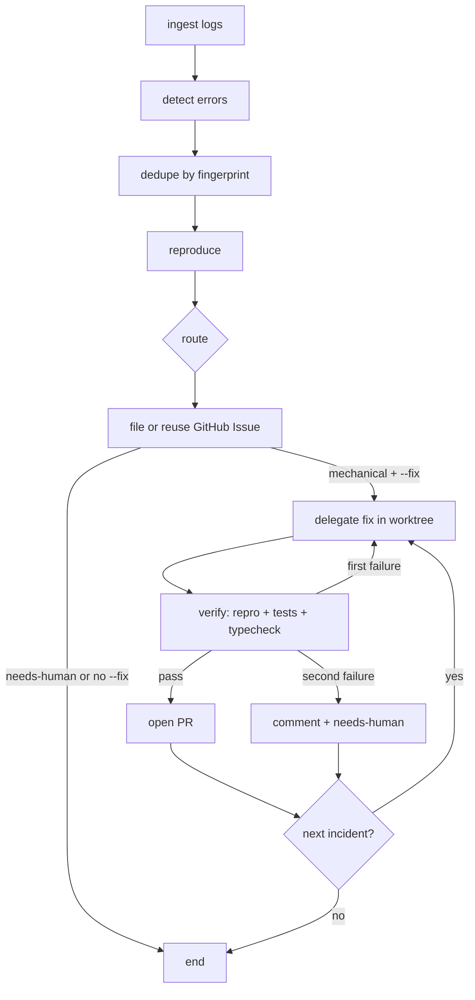

# bug-loop

An agent-pipeline demo: **logs → tickets → verified fixes**, built twice on the same contracts - once with **LangGraph JS** and once with the **Claude Agent SDK**.

The toy target is `apps/leaky-service`, a small order API that writes structured JSONL logs and ships with a handful of seeded failure modes.
Shared types and helpers live in `shared/`.
Pipelines consume those contracts; they do not re-invent fingerprinting, log reading, or GitHub ticket shape.

## Stage graph



## Design principles

- **Verifier before writer.** A fix is not done until the failure signature disappears, the suite passes, and TypeScript is clean.
- **Cycles are why you use a graph.** Fix ⇄ verify is a real conditional cycle with two attempts.
- **The pipeline never edits application code.** The `Fixer` interface delegates edits to `CodexFixer`, while tests inject `FakeFixer`.
- **Isolation is mandatory.** Each incident runs on `bugloop/fix-<fingerprint8>` in `.worktrees/<fingerprint8>` and is cleaned up after PR or give-up.
- **Failure routes to a human.** A second failed verification comments with evidence and swaps `auto-fix-candidate` for `needs-human`.

## Seeded bug categories

The service intentionally exercises four failure *categories* (no spoilers on exact lines):

1. **Null dereference** on create - missing nested fields crash the handler (mechanical).
2. **Unhandled rejection** on ship - an async provider path is not awaited or caught (mechanical).
3. **Invalid date parsing** on list filters - bad `since` values blow up ISO conversion (mechanical).
4. **Judgment / product ambiguity** on discounts - totals can go negative; the service warns and stores rather than deciding policy (must not be auto-fixed).

Happy-path tests avoid all four and pass with the bugs present.

## Quickstart

```bash
bun install

# Start the toy service (writes logs/leaky-service.jsonl)
bun run service

# In another terminal: generate mixed valid + buggy traffic
bun run traffic -- --count 50 --seed 42 --base http://localhost:3000

# Typecheck & tests
bun run typecheck
bun test
```

LangGraph pipeline commands:

```bash
# Triage only. GitHub calls are printed, not executed.
bun run pipeline:langgraph -- --from-start --base http://127.0.0.1:3000

# Run the real fix and verify loop in worktrees, but print push and GitHub mutations.
bun run pipeline:langgraph -- --from-start --fix --base http://127.0.0.1:3000

# Live proof. This reuses existing fingerprinted issues, pushes verified branches, and opens PRs.
bun run pipeline:langgraph -- --from-start --fix --live --base http://127.0.0.1:3000
```

`--fix` does not imply `--live`.
Without `--live`, code fixing, service reproduction, tests, typecheck, local worktree commits, and cleanup are real, while branch pushes and GitHub mutations are printed.
Run the dry fix command and live fix command as separate demos only after resetting branches, because both use deterministic branch names.

The verifier assigns a free service port and an isolated log path inside the worktree.
The service's default log path also resolves inside its checkout through `import.meta.dir`; the verifier sets `LOG_PATH` explicitly so each check starts from a fresh file.

## Reset the demo

Stop the service before resetting.

```bash
git checkout seeded -- apps/leaky-service

for number in 1 2 3 4; do
  gh issue close "$number" -R MichaelHabermas/bug-loop
done

gh pr list -R MichaelHabermas/bug-loop --state open --label bug-loop --json number --jq '.[].number' |
  while read -r number; do gh pr close "$number" -R MichaelHabermas/bug-loop; done

for branch in bugloop/fix-2239a31d bugloop/fix-8c3afcf4 bugloop/fix-923763aa; do
  git branch -D "$branch" 2>/dev/null || true
  git push origin --delete "$branch" 2>/dev/null || true
done
```

Delete `pipelines/langgraph/.cursor.json` if the next triage run should reread old logs without `--from-start`.

## Repo layout

```
apps/leaky-service/     # buggy order API + traffic generator + happy-path tests
shared/                 # stage contracts, fingerprint, logtail, gh helpers
pipelines/langgraph/    # LangGraph triage + fix/verify cycle
pipelines/agent-sdk/    # Day 4 stub
```

| Package | Role |
|---------|------|
| `@bug-loop/leaky-service` | HTTP API, JSONL logger, traffic script |
| `@bug-loop/shared` | `LogEvent`, `Fingerprint`, `Incident`, `TriageState`, … |
| `@bug-loop/pipeline-langgraph` | LangGraph triage and fix/verify implementation |
| `@bug-loop/pipeline-agent-sdk` | Agent SDK implementation |

## Root scripts

| Script | What it does |
|--------|----------------|
| `bun run typecheck` | Project references build (`tsc -b`) |
| `bun test` | All workspace tests |
| `bun run service` | Start leaky-service on `:3000` |
| `bun run traffic` | Run the seeded traffic generator |

## License

Demo / interview material - not production software.
