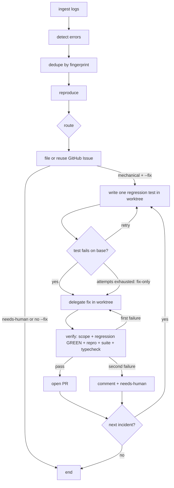

# bug-loop

An agent-pipeline demo: **logs → tickets → verified fixes**, built twice on the same contracts - once with **LangGraph JS** and once with the **Claude Agent SDK**.

## The 60-second answer

*This repo exists to answer "how would you set up your agent pipeline?" with something runnable.*

Most agent systems are pipeline-shaped - a router plus specialists covers the large majority of cases. Reach for a graph framework (LangGraph) when you need **cycles, conditional routing, shared state, or human-in-the-loop interrupts**; below that, a pipeline is typed functions + routing + state, and the framework buys you resumability, not intelligence. This repo is that claim, built both ways.

Three principles drive the design:

1. **Verification is the load-bearing layer.** Every stage that writes has a verifier in front of it: reproduction before the ticket, repro-gone + tests + typecheck before the PR. The fix→verify edge is a bounded retry cycle - exactly the thing a graph expresses that a chain can't.
2. **Route to the right capability.** Deterministic stages use no model. An application-owned tri-state policy authorizes known classes, denies policy-sensitive classes, and leaves everything else unknown. The Agent SDK pipeline may map unknowns to an authorized class with read-only tools; LangGraph is deliberately policy-only and sends unknowns to a human.
3. **Failure routes to a human, by design.** One seeded bug is a product-policy ambiguity; the pipeline reproduces it, documents it, and *declines to fix it*. Auto-PRs that waste review time burn trust faster than they save toil.

For review agents specifically: same shape, fan-out instead of a chain - parallel specialist reviewers, then dedupe and rank findings, with a confidence gate before anything reaches a human.

The toy target is `apps/leaky-service`, a small order API that writes structured JSONL logs and ships with a handful of seeded failure modes.
The reusable kit lives in `packages/core/` and is published as `@bug-loop/core`.
Pipelines consume those contracts; they do not re-invent fingerprinting, log reading, or GitHub ticket shape.

Open [docs/architecture.html](docs/architecture.html) locally for the interactive version - the architecture as independent pieces, plus a replay player that steps through a real run trace.

## Stage graph



## Design principles

- **Verifier before writer.** A fix is not done until the failure signature disappears, the suite passes, and TypeScript is clean.
- **Agentic judgment has a narrow seam.** Consumer policy owns authority. The Agent SDK agent can only map an unknown to a manifest-authorized class or return human; Grok or Codex executes; deterministic code verifies.
- **The pipeline never edits application code.** The core `Fixer` interface delegates edits to `GrokFixer` or `CodexFixer`, while tests inject `FakeFixer`.
- **Isolation is mandatory.** Each incident runs on `bugloop/fix-<fingerprint8>` in `.worktrees/<fingerprint8>` and is cleaned up after PR or give-up.
- **Failure routes to a human.** A second failed verification comments with evidence and swaps `auto-fix-candidate` for `needs-human`.

### Regression tests - manifest authority, red→green enforced

Eligibility is mechanical: the repro must be deterministic and the full suite must pass on the pristine incident worktree.
The application manifest supplies deterministic fixture metadata, `mustPin`, `mustNotPin`, and the test template for each authorized incident class.
Needs-human incidents receive only a `test.todo(...)` ambiguity question and never pin unratified behavior.
The agent `TestWriter` is a tier-two fallback only when the manifest explicitly does not support the incident shape; the fixer remains confined to `fixScope`.
Snapshot tests and exact-message assertions are banned unless message text is explicitly part of `mustPin`.
The generated test must fail before the source fix, then pass after it alongside the repro check, full suite, and typecheck.
The RED check runs directly in the still-unfixed incident worktree, then the proven test is committed before the fixer runs.
If RED cannot be established within `maxFixAttempts`, the pipeline resets the rejected test changes and continues with a fix-only PR.
`regressionTests` selects `always`, `triage-decides` (default), or `never`; `BUGLOOP_TESTWRITER=grok|codex` selects the writer.
Every PR quotes the assertion specification under `## Regression test intent` so review ratifies the intended contract.

## Two implementations, one pipeline

| | LangGraph | Agent SDK |
|---|---|---|
| Orchestration | `StateGraph`, bounded immutable incident workers, `MemorySaver` | Typed functions, bounded immutable incident workers, explicit branches |
| Triage judgment | Consumer policy only; unknown routes to human | Consumer policy, then Claude Agent SDK for unknowns with read-only `Read`/`Grep`/`Glob` access |
| Fix planning | Issue and reproduction evidence | SDK result adds a 2-4 sentence root-cause fix brief |
| Fix execution | `CodexFixer` by default | `GrokFixer` by default |
| Verification and lifecycle | Core deterministic verifier, worktree, GitHub helpers | The same core machinery |

Both implementations accept `BUGLOOP_FIXER=codex|grok|opencode`.
The defaults preserve the comparison: LangGraph uses Codex, while Agent SDK uses Grok.
`BUGLOOP_TRIAGE_MODEL` selects the SDK triage model and defaults to `sonnet`.
`BUGLOOP_OPENCODE_MODEL` is required when using OpenCode and should be the full `openrouter/<model-id>`.

## Seeded bug categories

Benchmark identity: `leaky-service-seeded-v2` (14 incidents). Categories below — no spoilers on exact lines.

### Easy / mechanical (single-request deterministic) — 7 total (3 original + 4 new)

1. **Null dereference** on create - missing nested fields crash the handler.
2. **Unhandled rejection** on ship - an async provider path is not awaited or caught.
3. **Invalid date parsing** on list filters - bad `since` values blow up ISO conversion.
4. **Unguarded line-item index** on order items - out-of-range index access crashes.
5. **Malformed body parse** on import - non-JSON payloads take down the import route.
6. **Missing-resource 500** on receipt - absent orders surface as internal errors instead of 404.
7. **Empty stats window** - a zero-width sample window crashes average computation.

### Medium / multi-step or state-dependent — 4

8. **Ship-then-cancel** - cancel after ship hits a reverse-shipment path that assumes ledger state.
9. **Pagination overflow** - deep list pages after enough orders hit a short jump-table fast path.
10. **Header-dependent export** - an export request header takes a code path that assumes optional customer fields.
11. **Double-ship corruption** - a second ship call takes an “idempotent refresh” path that assumes audit state.

### Judgment / deny — 1

12. **Product ambiguity on discounts** - totals can go negative; the service warns and stores rather than deciding policy (must not be auto-fixed).

### Unknown-class (reproducible, not policy-authorized) — 2

13. **Auth-ish refund token** - malformed bearer tokens crash; correct status (401 vs 400 vs 500) is product-judgment adjacent, so the class is deliberately unregistered and must route `unknown` (agent tier / human fallback).
14. **Tax region preview** - tax calculation assumes a customer region that orders never carry; whether missing region means tax=0 or client error is unsettled, so the class is unregistered.

Happy-path tests avoid every trigger and pass with the bugs present.
Meta repro-fires checks live under `bench/seeded-bugs/` (`bun run test:bench`) so they assert bugs exist without participating in pipeline suite-eligibility or post-fix verification.

## Quickstart

```bash
bun install

# Start the toy service (writes logs/leaky-service.jsonl)
bun run service

# In another terminal: generate mixed valid + buggy traffic
bun run traffic -- --count 50 --seed 42 --base http://localhost:3000

# Typecheck & tests
bun run typecheck
bun test
```

LangGraph pipeline commands:

```bash
# Triage only. GitHub calls are printed, not executed.
bun run pipeline:langgraph -- --from-start --base http://127.0.0.1:3000

# Run the real fix and verify loop in worktrees, but print push and GitHub mutations.
bun run pipeline:langgraph -- --from-start --fix --base http://127.0.0.1:3000

# Live proof. This reuses existing fingerprinted issues, pushes verified branches, and opens PRs.
bun run pipeline:langgraph -- --from-start --fix --live --base http://127.0.0.1:3000
```

Plain TypeScript Agent SDK pipeline commands:

```bash
# SDK triage plans, Grok fixes, and deterministic code verifies. Dry by default.
bun run pipeline:agent-sdk -- --from-start --fix --base http://127.0.0.1:3000

# Live proof after reviewing the dry run.
bun run pipeline:agent-sdk -- --from-start --fix --live --base http://127.0.0.1:3000
```

`--fix` does not imply `--live`.
Every pipeline invocation writes a machine-readable trace under `traces/`; pass `--trace <path>` to override the destination.
Without `--live`, code fixing, service reproduction, tests, typecheck, local worktree commits, and cleanup are real, while branch pushes and GitHub mutations are printed.
Run the dry fix command and live fix command as separate demos only after resetting branches, because both use deterministic branch names.

### Watch mode

`--watch` keeps the pipeline running as a daemon: it polls the log (default every 15s), waits for a quiet gap after new lines (default 5s), then runs the **same** one-shot pass (triage, tickets, optional fix loop). Cursor + GitHub markers still dedupe across passes. Without `--fix` you get continuous triage only; add `--fix` (and optionally `--live`) with the usual meaning. `--from-start` is refused with `--watch`.

```bash
# Terminal 1: service
bun run service

# Terminal 2: watch daemon (dry fix — real worktrees, printed GitHub)
bun run pipeline:langgraph -- --watch --fix --base http://127.0.0.1:3000
# or: bun run pipeline:agent-sdk -- --watch --fix --base http://127.0.0.1:3000

# Terminal 3: send traffic in bursts; the daemon batches each quiet period into a pass
bun run traffic -- --count 20 --seed 1 --base http://127.0.0.1:3000
# wait for the pass to finish, then send another burst
bun run traffic -- --count 20 --seed 2 --base http://127.0.0.1:3000
```

Timing overrides: `BUGLOOP_WATCH_POLL_MS`, `BUGLOOP_WATCH_DEBOUNCE_MS`, `BUGLOOP_WATCH_HEARTBEAT_MS`.
Each pass writes its own trace labeled `…-watch-passN` with a shared `watchSessionId`. Ctrl-C finishes the in-flight pass, writes that pass’s trace, then exits 0.

The verifier assigns a free service port and an isolated log path inside the worktree.
The service's default log path also resolves inside its checkout through `import.meta.dir`; the verifier sets `LOG_PATH` explicitly so each check starts from a fresh file.

## Open-model sweeps (OpenRouter)

Matrix cost/quality sweeps over OpenRouter models via the [OpenCode](https://opencode.ai) CLI (`BUGLOOP_FIXER=opencode`). **Money-true USD** comes from OpenRouter generation/activity APIs — never from fabricated estimates.

### Prerequisites

1. **opencode** installed and on `PATH` (`opencode --version`).
2. **OpenRouter auth** for opencode (provider auth may be written into opencode's `auth.json` at job start) plus **`OPENROUTER_API_KEY`** in the environment for cost telemetry.
3. **leaky-service** listening (default `http://127.0.0.1:3000`).
4. **Verify model ids** against the live catalog before spending real money — the shortlist in `scripts/model-sweep.config.json` is a research placeholder:

```bash
export OPENROUTER_API_KEY=sk-or-...
bun run scripts/verify-models.ts
# Edit scripts/model-sweep.config.json if any id is missing or renamed.
```

Configured placeholders (must be verified): `deepseek/deepseek-v4-pro`, `qwen/qwen3-coder`, `z-ai/glm-5.2`, `moonshotai/kimi-k2.7-code`, `nvidia/nemotron-3-super-120b-a12b`.

### Pilot (1 model × 1 trial)

Cheap smoke before a full matrix:

```bash
bun run service   # separate terminal
./scripts/model-sweep.sh --pilot
```

Runs agent-sdk dry-fix with `BUGLOOP_FIXER=opencode`, rotating traffic seed, reset cursor, label `or-<model-short>-t1`, trace under `traces/sweep-or-…json`.

### Full matrix

Default: each configured model × 3 trials (fresh traffic seed, cursor reset, dry-fix each time):

```bash
./scripts/model-sweep.sh
# optional: --base http://127.0.0.1:3000 --config scripts/model-sweep.config.json
```

### Budget-halt behavior

- Soft **budget cap** default **$20** USD (operator ceiling).
- Hard **halt** when cumulative **reported** OpenRouter USD across the sweep exceeds **$18** (halt margin vs cap).
- After each trial the runner sums `usage.status === "reported"` USD from that trial's trace; if cumulative `> $18`, it prints a clear `BUDGET HALT` message and stops (exit 3).
- Samples without generation ids are **not fabricated**: they are marked `unavailable` or, when requested, filled only from OpenRouter's activity window for the API key (documented as `openrouter-activity-fallback`).

Supporting code: `packages/core/src/openrouter.ts` (telemetry), `OpenCodeFixer` / `OpenCodeTestWriter`, `scripts/model-sweep.ts` + `scripts/model-sweep.sh`, `scripts/verify-models.ts`.

## Field notes from the live runs

This ran for real (see [issues #1–#4](https://github.com/MichaelHabermas/bug-loop/issues?q=is%3Aissue) and [PRs #5–#7](https://github.com/MichaelHabermas/bug-loop/pulls)). The failures along the way are the best part of the story:

- **Run against a dead service** → 0 reproduced → everything routed `needs-human`. The pipeline never fixes what it can't reproduce.
- **Correct fixes, rejected.** Fresh git worktrees didn't get their own `bun install`, so verification failed on resolution errors unrelated to the fixes. All three fixes had *passed their repros* - and the pipeline still refused to open PRs it couldn't verify, leaving evidence comments and swapping labels to `needs-human` instead. Verification-as-load-bearing-layer, demonstrated by the system choosing trust over throughput.
- **Triage agent auth expiry** → heuristic fallback carried the run; the fix loop continued degraded rather than dying.
- Working runs: codex fixed 3/3 through the LangGraph pipeline (real PRs with before/after evidence); the SDK-plans-grok-executes pipeline fixed 3/3 first-attempt in dry mode, with the SDK's fix briefs deriving root causes from actual source reading (e.g. `timeoutMs: 15 < latencyMs: 80` ⇒ the ship promise always rejects).

## Production gaps (known, deliberate)

Demo-sized simplifications you'd close before trusting this at work - kept honest here because reciting them beats pretending the happy path is the system:

- **Backpressure**: a 50-fingerprint log storm means 50 issues and 50 fix attempts; needs per-run caps and a cost budget.
- **Concurrency**: no run lock; racing instances would duplicate issues and clobber worktrees.
- **Dedupe edges**: only *open* issues are marker-searched (recurrence after close files fresh, unlinked); GitHub search indexing lag is a small race window; fingerprints can drift (same cause, changed message) or collide (distinct bugs, same name+frame+route).
- **Intermittent bugs**: repro is one-shot, so flaky bugs route `needs-human` - safe but low recall.
- **Cost completeness**: SDK cost is structured, while Codex and Grok capture only usage lines their CLIs choose to print.

Implemented efficiency controls include one dedupe query per run, issue-body caching per incident, bounded fix fan-out behind `incidentConcurrency`, and fail-fast verification from scope through typecheck.
Remaining candidates include a "seen again, count N" heartbeat on open issues and batching unknown triage into one SDK session.

## Reset the demo

Stop the service before resetting.

The seeded branch restores the buggy service sources (now 14 incidents under `leaky-service-seeded-v2`). Close any open bug-loop issues/PRs from the prior run; fingerprint branch names are deterministic per incident hash, so delete whichever `bugloop/fix-*` branches the last run created rather than a fixed list.

```bash
git checkout seeded -- apps/leaky-service

# Close open issues filed by the pipeline (adjust the range or query as needed)
gh issue list -R MichaelHabermas/bug-loop --state open --label bug-loop --json number --jq '.[].number' |
  while read -r number; do gh issue close "$number" -R MichaelHabermas/bug-loop; done

gh pr list -R MichaelHabermas/bug-loop --state open --label bug-loop --json number --jq '.[].number' |
  while read -r number; do gh pr close "$number" -R MichaelHabermas/bug-loop; done

git branch --list 'bugloop/fix-*' | while read -r branch; do
  git branch -D "$branch" 2>/dev/null || true
  git push origin --delete "$branch" 2>/dev/null || true
done
```

Delete the relevant pipeline's `.cursor.json` if the next triage run should reread old logs without `--from-start`.

## Repo layout

```
apps/leaky-service/     # buggy order API + traffic generator + happy-path tests
packages/core/          # reusable config, contracts, machinery, tracing
pipelines/langgraph/    # LangGraph triage + fix/verify cycle
pipelines/agent-sdk/    # Plain TypeScript orchestration + Claude Agent SDK triage
```

| Package | Role |
|---------|------|
| `@bug-loop/leaky-service` | HTTP API, JSONL logger, traffic script |
| `@bug-loop/core` | Config, adapters, pipeline contracts, verification, and tracing |
| `@bug-loop/pipeline-langgraph` | LangGraph triage and fix/verify implementation |
| `@bug-loop/pipeline-agent-sdk` | Agent SDK implementation |

A new consumer supplies one `PipelineConfig`, one `ReproStrategy`, and structured JSONL logs.
The short contract and extension points are documented in [`packages/core/README.md`](packages/core/README.md).

## Root scripts

| Script | What it does |
|--------|----------------|
| `bun run typecheck` | Project references build (`tsc -b`) |
| `bun test` | All workspace tests |
| `bun run pipeline:langgraph` | Run the LangGraph implementation |
| `bun run pipeline:agent-sdk` | Run the plain TypeScript Agent SDK implementation |
| `bun run service` | Start leaky-service on `:3000` |
| `bun run traffic` | Run the seeded traffic generator |
| `bun run test:bench` | Seeded-bug repro-fires meta-suite (outside app eligibility) |

## License

Demo / interview material - not production software.
